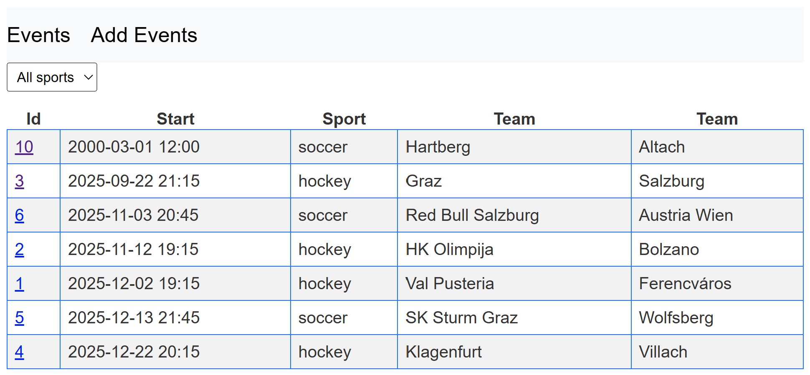
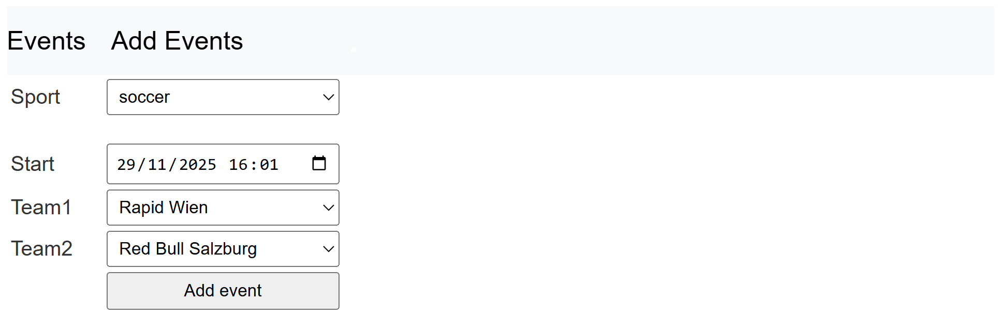

# Sportradar Demo Application

## Overview

The **Sportradar Demo Application** is a simple web-based sports event management system built using **Spring Boot** and **Java**.  
It demonstrates core backend development principles and provides an example of how to build a structured, maintainable web application with server-side rendering.

- **Layered Architecture:**  
  The codebase is organized into `Controller` and `Repository` layers, ensuring a clean separation of concerns.

- **Database Interaction:**  
  Uses **Spring’s `JdbcTemplate`** to connect to a **MySQL** database and execute SQL queries directly.

- **Server-Side Rendering:**  
  Uses **Thymeleaf** to dynamically generate HTML pages that display sports, teams, and events.

### UI Overview
#### Listing events
Clicking the event id will navigate to the detail page of the selected event.  


#### Adding a new event


---

## How to Set Up and Run

Follow the steps below to set up and run the application locally.

### Prerequisites

Before starting, ensure you have the following installed:

- **Java Development Kit (JDK)** — Version **21** or higher  
- **Apache Maven** — To build the project and manage dependencies  
- **MySQL Server** — To store the application data  
- **Git** — To clone the repository

---

### 1. Clone the Repository

Open your terminal and run:

```bash
git clone https://github.com/milihe/sport-calendar.git
cd sport-calendar
```

---

### 2. Set Up the Database

This application requires a MySQL database with a specific schema.

1. Start your **MySQL server**.
2. Execute the SQL script located at:  
   `src/db/db.txt`  
   This script creates the necessary tables (`sports`, `teams`, `events`) and populates them with initial data.

---

### 3. Configure the Application

Open the file:

```
src/main/resources/application.properties
```

Update the following fields with your local MySQL credentials:

```properties
spring.datasource.username=root
spring.datasource.password=your-password
```
If your db server does not run on localhost, you can update the `spring.datasource.url` property accordingly.

---

### 4. Build and Run the Application

You can build and run the application using **Maven**.

From the project root directory, execute:

```bash
./mvnw spring-boot:run
```

> **Windows users:**  
> Use the command below instead:
> ```bash
> mvnw.cmd spring-boot:run
> ```
> (If the command above fails, because your JAVA_HOME environment variable is undefined,
> set it by running the `set JAVA_HOME="C:\path\to\your\java"` command before retrying again)

Once the application starts, open your browser and visit:

👉 [http://localhost:8080](http://localhost:8080)

You should see the home page listing sports events.

---

## Assumptions and Decisions

- The application is designed for **demo purposes**, focusing on backend and database integration.
- **JdbcTemplate** was used to keep database interactions explicit and straightforward.
- **Thymeleaf** was chosen for simplicity and native Spring Boot integration, making it easy to render dynamic content on the server side.
- Initial data (sports, teams, events) is preloaded via an SQL script to simplify testing.
- All configuration values (e.g., DB credentials) are stored in `application.properties` for local development.

---
